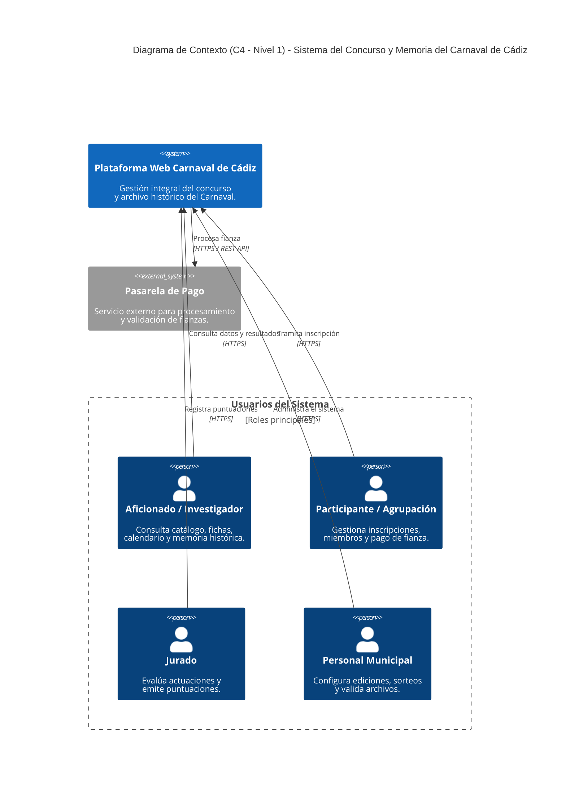

# Diseño de la arquitectura

```mermaid
C4Context
    title Diagrama de Contexto (C4 - Nivel 1) - Sistema del Concurso y Memoria del Carnaval de Cádiz

    UpdateLayoutConfig($c4ShapeInRow="2", $c4BoundaryInRow="1")

    Boundary(b1, "Usuarios del Sistema", "Roles principales") {
        Person(aficionado, "Aficionado / Investigador", "Consulta catálogo, fichas,<br/>calendario y memoria histórica.")
        Person(agrupacion, "Participante / Agrupación", "Gestiona inscripciones,<br/>miembros y pago de fianza.")
        Person(jurado, "Jurado", "Evalúa actuaciones y<br/>emite puntuaciones.")
        Person(admin, "Personal Municipal", "Configura ediciones, sorteos<br/>y valida archivos.")
    }

    System(sistemaCarnaval, "Plataforma Web Carnaval de Cádiz", "Gestión integral del concurso<br/>y archivo histórico del Carnaval.")
    
    System_Ext(pago, "Pasarela de Pago", "Servicio externo para procesamiento<br/>y validación de fianzas.")

    Rel_D(aficionado, sistemaCarnaval, "Consulta datos y resultados", "HTTPS")
    Rel_D(agrupacion, sistemaCarnaval, "Tramita inscripción", "HTTPS")
    Rel_D(jurado, sistemaCarnaval, "Registra puntuaciones", "HTTPS")
    Rel_D(admin, sistemaCarnaval, "Administra el sistema", "HTTPS")

    Rel_R(sistemaCarnaval, pago, "Procesa fianza", "HTTPS / REST API")

```
