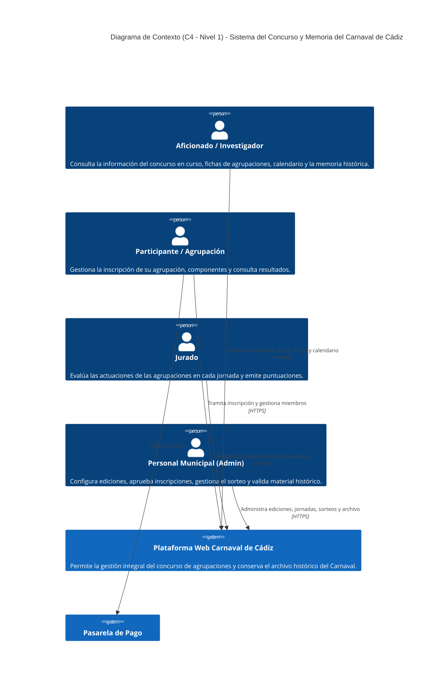

# Diseño de la aruitectura

```mermaid
C4Context
    title Diagrama de Contexto (C4 - Nivel 1) - Sistema del Concurso y Memoria del Carnaval de Cádiz

    Person(aficionado, "Aficionado / Investigador", "Consulta la información del concurso en curso, fichas de agrupaciones, calendario y la memoria histórica.")
    Person(agrupacion, "Participante / Agrupación", "Gestiona la inscripción de su agrupación, componentes y consulta resultados.")
    Person(jurado, "Jurado", "Evalúa las actuaciones de las agrupaciones en cada jornada y emite puntuaciones.")
    Person(admin, "Personal Municipal (Admin)", "Configura ediciones, aprueba inscripciones, gestiona el sorteo y valida material histórico.")

    System(sistemaCarnaval, "Plataforma Web Carnaval de Cádiz", "Permite la gestión integral del concurso de agrupaciones y conserva el archivo histórico del Carnaval.")
    System(pago, "Pasarela de Pago")

    Rel(aficionado, sistemaCarnaval, "Consulta resultados, letras, fichas y calendario", "HTTPS")
    Rel(agrupacion, sistemaCarnaval, "Tramita inscripción y gestiona miembros", "HTTPS")
    Rel(jurado, sistemaCarnaval, "Registra puntuaciones de actuaciones", "HTTPS")
    Rel(admin, sistemaCarnaval, "Administra ediciones, jornadas, sorteos y archivo", "HTTPS")
    Rel(agrupacion, pago, "Pago de fianza")

```
