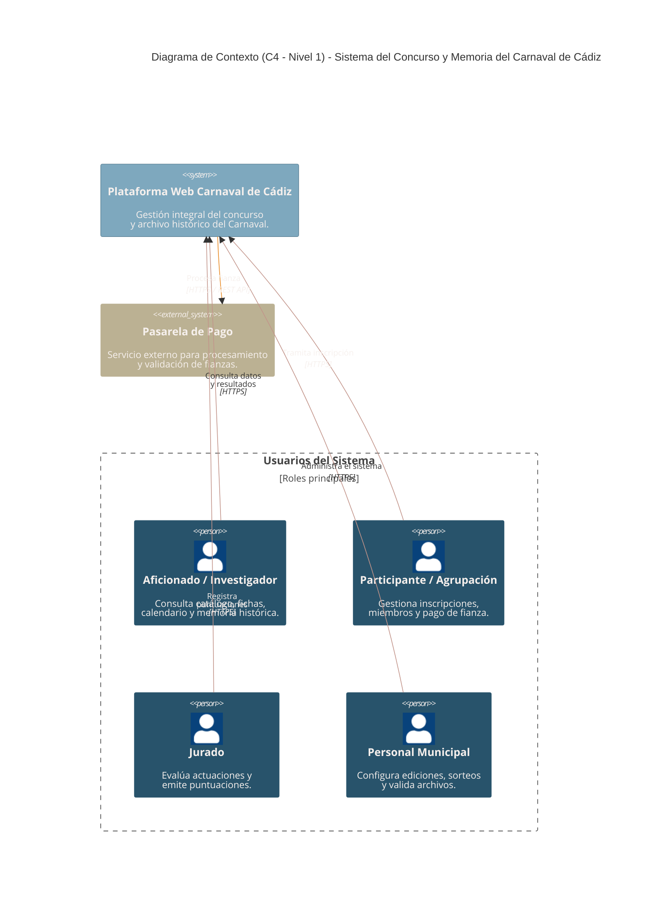
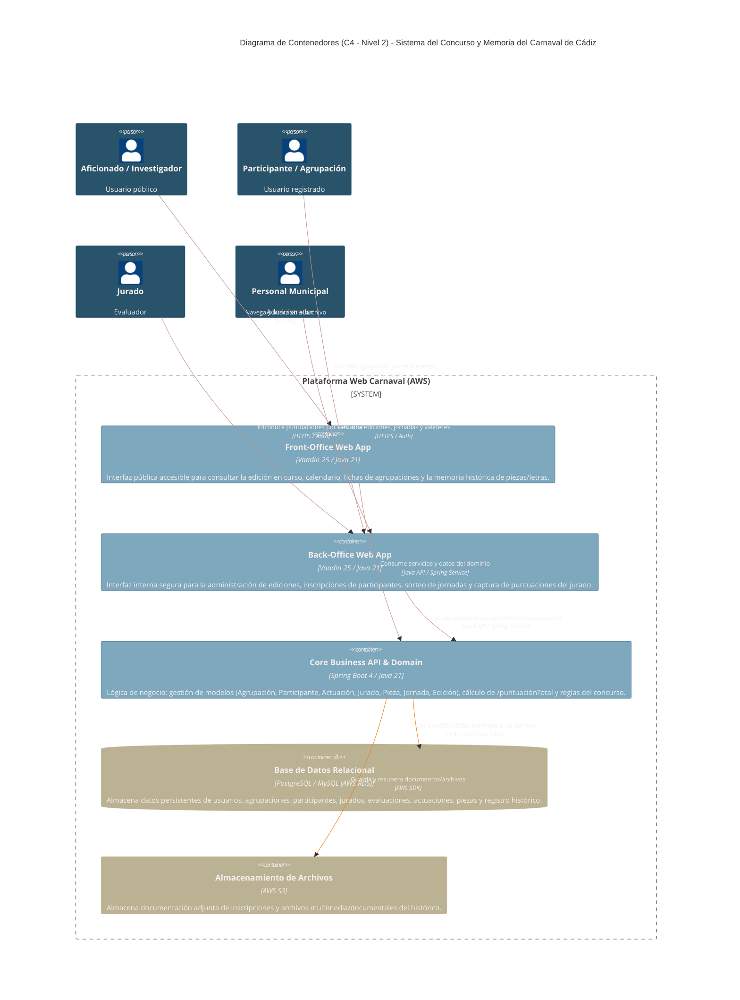

# Diseño de la arquitectura

```mermaid
C4Context
    title Diagrama de Contexto (C4 - Nivel 1) - Sistema del Concurso y Memoria del Carnaval de Cádiz

    UpdateLayoutConfig($c4ShapeInRow="2", $c4BoundaryInRow="1")

    Boundary(b1, "Usuarios del Sistema", "Roles principales") {
        Person(aficionado, "Aficionado / Investigador", "Consulta catálogo, fichas,<br/>calendario y memoria histórica.")
        Person(agrupacion, "Participante / Agrupación", "Gestiona inscripciones,<br/>miembros y pago de fianza.")
        Person(jurado, "Jurado", "Evalúa actuaciones y<br/>emite puntuaciones.")
        Person(admin, "Personal Municipal", "Configura ediciones, sorteos<br/>y valida archivos.")
    }

    System(sistemaCarnaval, "Plataforma Web Carnaval de Cádiz", "Gestión integral del concurso<br/>y archivo histórico del Carnaval.")
    
    System_Ext(pago, "Pasarela de Pago", "Servicio externo para procesamiento<br/>y validación de fianzas.")

    Rel_D(aficionado, sistemaCarnaval, "Consulta datos <br/>y resultados", "HTTPS")
    Rel_D(agrupacion, sistemaCarnaval, "Tramita inscripción", "HTTPS")
    Rel_D(jurado, sistemaCarnaval, "Registra <br/>puntuaciones", "HTTPS")
    Rel_D(admin, sistemaCarnaval, "Administra el sistema", "HTTPS")

    Rel_R(sistemaCarnaval, pago, "Procesa fianza", "HTTPS / REST API")

    UpdateRelStyle(aficionado, sistemaCarnaval, $textColor="f6f0ed", $lineColor="#c2948a", $offsetX="-15")
    UpdateRelStyle(jurado, sistemaCarnaval, $textColor="#f6f0ed", $lineColor="#c2948a", $offsetX="-20", $offsetY="200")
    UpdateRelStyle(sistemaCarnaval, pago, $textColor="#f6f0ed", $lineColor="#e8871e", $offsetX="-50", $offsetY="10")
    UpdateRelStyle(admin, sistemaCarnaval, $textColor="f6f0ed", $lineColor="#c2948a", $offsetX="-15")
    UpdateRelStyle(agrupacion, sistemaCarnaval, $textColor="#f6f0ed", $lineColor="#c2948a", $offsetX="-50", $offsetY="-40")
    UpdateElementStyle(jurado, $fontColor="#f6f0ed", $bgColor="#28536b", $borderColor="#28536b")
    UpdateElementStyle(admin, $fontColor="#f6f0ed", $bgColor="#28536b", $borderColor="#28536b")
    UpdateElementStyle(agrupacion, $fontColor="#f6f0ed", $bgColor="#28536b", $borderColor="#28536b")
    UpdateElementStyle(aficionado, $fontColor="#f6f0ed", $bgColor="#28536b", $borderColor="#28536b")
    UpdateElementStyle(sistemaCarnaval, $fontColor="#f6f0ed", $bgColor="#7ea8be", $borderColor="#28536b")
    UpdateElementStyle(pago, $fontColor="#f6f0ed", $bgColor="#bbb193", $borderColor="#bbb193")

```

```mermaid
C4Container
    title Diagrama de Contenedores (C4 - Nivel 2) - Sistema del Concurso y Memoria del Carnaval de Cádiz

    Person(aficionado, "Aficionado / Investigador", "Usuario público")
    Person(agrupacion, "Participante / Agrupación", "Usuario registrado")
    Person(jurado, "Jurado", "Evaluador")
    Person(admin, "Personal Municipal", "Administrador")

    System_Boundary(b1, "Plataforma Web Carnaval (AWS)") {
        Container(frontoffice, "Front-Office Web App", "Vaadin 25 / Java 21", "Interfaz pública accesible para consultar la edición en curso, calendario, fichas de agrupaciones y la memoria histórica de piezas/letras.")
        
        Container(backoffice, "Back-Office Web App", "Vaadin 25 / Java 21", "Interfaz interna segura para la administración de ediciones, inscripciones de participantes, sorteo de jornadas y captura de puntuaciones del jurado.")

        Container(backend, "Core Business API & Domain", "Spring Boot 4 / Java 21", "Lógica de negocio: gestión de modelos (Agrupación, Participante, Actuación, Jurado, Pieza, Jornada, Edición), cálculo de /puntuaciónTotal y reglas del concurso.")

        ContainerDb(database, "Base de Datos Relacional", "PostgreSQL / MySQL (AWS RDS)", "Almacena datos persistentes de usuarios, agrupaciones, participantes, jurados, evaluaciones, actuaciones, piezas y registro histórico.")

        Container(storage, "Almacenamiento de Archivos", "AWS S3", "Almacena documentación adjunta de inscripciones y archivos multimedia/documentales del histórico.")
    }

    Rel(aficionado, frontoffice, "Navega y busca en el archivo", "HTTPS")
    Rel(agrupacion, backoffice, "Inscribe agrupación y componentes", "HTTPS / Auth")
    Rel(jurado, backoffice, "Introduce puntuaciones por actuación", "HTTPS / Auth")
    Rel(admin, backoffice, "Gestiona ediciones, jornadas y valideces", "HTTPS / Auth")

    Rel(frontoffice, backend, "Consume servicios y datos del dominio", "Java API / Spring Service")
    Rel(backoffice, backend, "Ejecuta operaciones del concurso y evaluación", "Java API / Spring Service")

    Rel(backend, database, "Lee y escribe datos del modelo de dominio", "JPA / Hibernate / JDBC")
    Rel(backend, storage, "Guarda y recupera documentos/archivos", "AWS SDK")

    %% Estilos de Personas (Azul oscuro)
    UpdateElementStyle(aficionado, $fontColor="#f6f0ed", $bgColor="#28536b", $borderColor="#28536b")
    UpdateElementStyle(agrupacion, $fontColor="#f6f0ed", $bgColor="#28536b", $borderColor="#28536b")
    UpdateElementStyle(jurado, $fontColor="#f6f0ed", $bgColor="#28536b", $borderColor="#28536b")
    UpdateElementStyle(admin, $fontColor="#f6f0ed", $bgColor="#28536b", $borderColor="#28536b")

    %% Estilos de Contenedores de Aplicaciones (Azul claro)
    UpdateElementStyle(frontoffice, $fontColor="#f6f0ed", $bgColor="#7ea8be", $borderColor="#28536b")
    UpdateElementStyle(backoffice, $fontColor="#f6f0ed", $bgColor="#7ea8be", $borderColor="#28536b")
    UpdateElementStyle(backend, $fontColor="#f6f0ed", $bgColor="#7ea8be", $borderColor="#28536b")

    %% Estilos de Almacenamiento / Datos (Tono dorado/arena)
    UpdateElementStyle(database, $fontColor="#f6f0ed", $bgColor="#bbb193", $borderColor="#bbb193")
    UpdateElementStyle(storage, $fontColor="#f6f0ed", $bgColor="#bbb193", $borderColor="#bbb193")

    %% Estilos de Conexiones
    UpdateRelStyle(aficionado, frontoffice, $textColor="#f6f0ed", $lineColor="#c2948a")
    UpdateRelStyle(agrupacion, backoffice, $textColor="#f6f0ed", $lineColor="#c2948a")
    UpdateRelStyle(jurado, backoffice, $textColor="#f6f0ed", $lineColor="#c2948a")
    UpdateRelStyle(admin, backoffice, $textColor="#f6f0ed", $lineColor="#c2948a")
    UpdateRelStyle(frontoffice, backend, $textColor="#f6f0ed", $lineColor="#c2948a")
    UpdateRelStyle(backoffice, backend, $textColor="#f6f0ed", $lineColor="#c2948a")
    UpdateRelStyle(backend, database, $textColor="#f6f0ed", $lineColor="#e8871e")
    UpdateRelStyle(backend, storage, $textColor="#f6f0ed", $lineColor="#e8871e")
```
