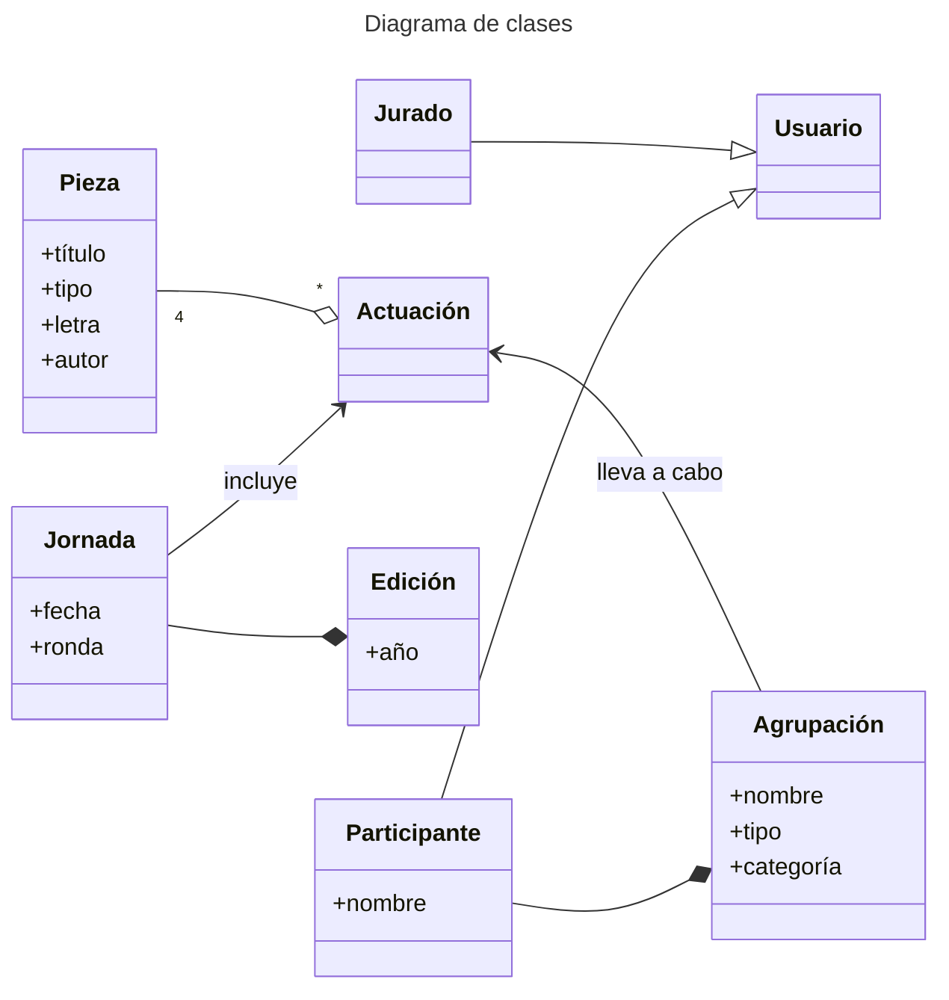

requisitos

```mermaid
---
title: Diagrama de clases
---
classDiagram
    direction RL
    Agrupación *-- Participante
    Agrupación --> Actuación : lleva a cabo
    Actuación <-- Jornada : incluye
    Actuación "*"o--"4" Pieza
    Edición *-- Jornada
    Usuario <|-- Participante
    Usuario <|-- Jurado
    class Agrupación{
        +nombre
        +tipo
        +categoría
    }
    class Participante {
        +nombre
    }
    class Jornada {
        +fecha
        +ronda
    }
    class Pieza {
        +título
        +tipo
        +letra
        +autor
    }
    class Edición {
        +año
    }
```
