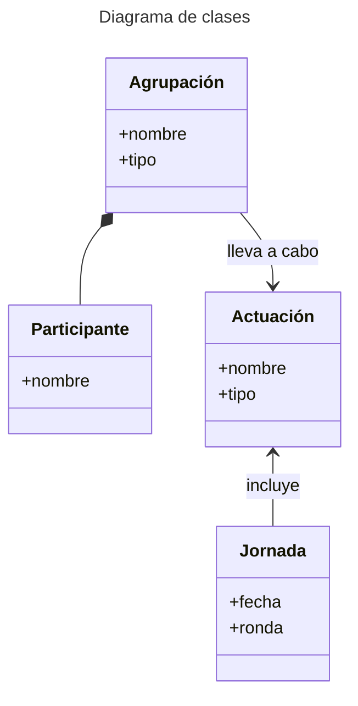

requisitos

```mermaid
---
title: Diagrama de clases
---
classDiagram
    Agrupación *-- Participante
    Agrupación --> Actuación : lleva a cabo
    Actuación <-- Jornada : incluye
    class Agrupación{
        +nombre
        +tipo
    }
    class Participante {
        +nombre
    }
    class Actuación {
        +nombre
        +tipo
    }
    class Jornada {
        +fecha
        +ronda
    }
```
